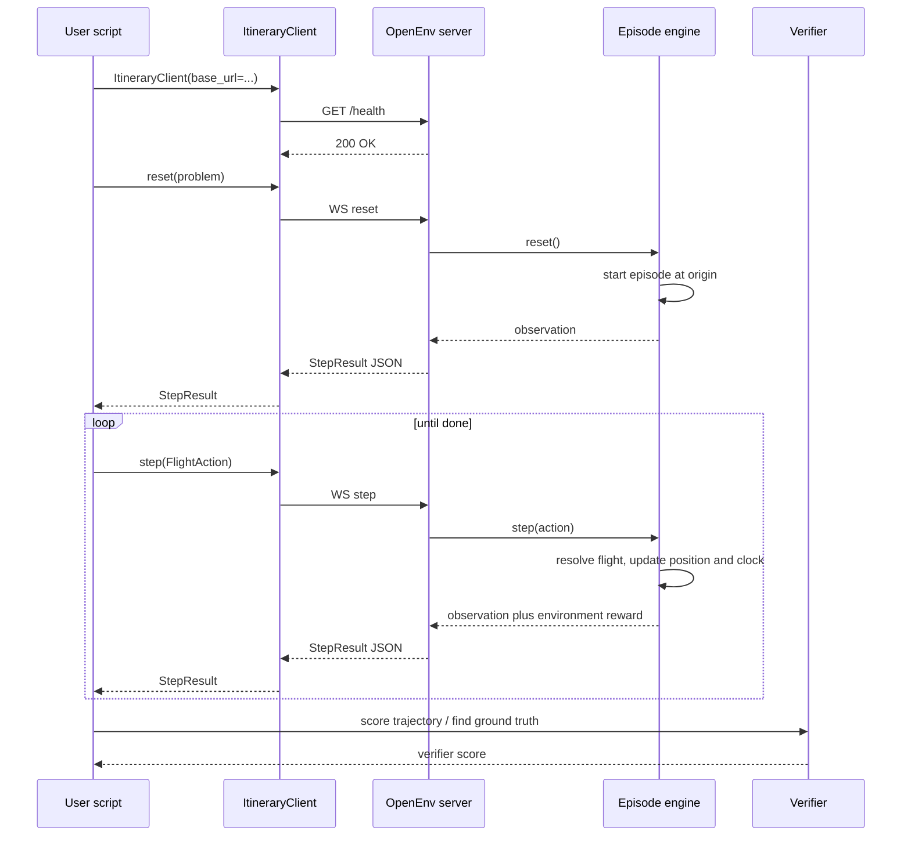

# Itinerary environment

This document is largely AI-generated.

## System architecture

GitHub renders Mermaid on this page. The live path is OpenEnv reset/step. The verifier runs after the episode, not inside each step. The BTS extract is mounted into Docker when the server starts; it is not on the step path every time.



The OpenEnv server usually runs in Docker. Environment weights fill `observation.reward` on each step. Verifier weights are a separate list and are not written into the observation.

## What this system is

An episode is a walk on a flight graph. Each step adds one leg, or rejects the request. A finished trajectory is an action sequence the verifier scores. Generated solutions are compared with a ground-truth path under the verifier's weights, not under the environment reward.

Evaluations are deterministic. The same problem file, the same dataset, and the same actions always produce the same result. There is no sampled week, no per-leg random draw, and no hidden calendar date.

## Dataset

Marketing Carrier On-Time Performance, from the BTS field list. The file is not stored in git. The loader opens a path given at runtime.

The first extract used to prove the loader is January 2026, about 602,954 flights. A later five-year extract is the same schema and the same loader. January alone is not a reliability history. It is enough to check that the columns can be read.

Columns the loader must expose:

| Column | Use |
|---|---|
| `FL_DATE`, `DAY_OF_WEEK` | Weekday template. BTS `DAY_OF_WEEK` is 1 = Monday through 7 = Sunday. |
| `MKT_UNIQUE_CARRIER`, `MKT_CARRIER_FL_NUM` | Action carrier and flight identity shown to the agent. |
| `OP_UNIQUE_CARRIER`, `OP_CARRIER_FL_NUM` | Reliability grouping, stored on the resolved row. |
| `ORIGIN`, `DEST` | Airports. These are the task endpoints and the graph nodes. |
| `ORIGIN_CITY_NAME`, `DEST_CITY_NAME` | Attributes only. Not task endpoints. |
| `CRS_DEP_TIME`, `CRS_ARR_TIME` | Exact scheduled times. Military `HHMM`. |
| `ARR_DELAY_NEW` | Late minutes only. Zero if not late. Never treat an arrival as earlier than scheduled. |
| `CANCELLED`, `DIVERTED` | `0.00` or `1.00`. |
| `DIV1_AIRPORT` | Diversion airport. Often empty. |
| `DISTANCE` | Leg miles for the `distance` term. |

City names are quoted and include the state, as in `"New York, NY"`.

## Graph

Built once per dataset version and shared by every problem. It stores topology and raw attributes. It does not store rewards, ranks, or shortest paths.

- A node is an airport.
- A raw edge is one historical flight on one date.
- A query filters that graph. It does not drop edges when the graph is built.

Two identities are not the same key.

**Match key.** What an action selects: current airport, destination airport, marketing carrier, weekday, exact scheduled departure. If two rows still match, the request is illegal. It is not silently picked.

**Reliability group.** What `cancellation_rate` aggregates: operating carrier, operating flight number, weekday, origin airport, destination airport. Different scheduled times of that operating flight share a rate. Different airport pairs never do. Dallas/Fort Worth to Tucson is not pooled with Tucson to Dallas/Fort Worth.

A generic week is a Monday-to-Sunday template. Later legs may leave after midnight. The weekday rolls forward. Overnight time is a positive span.

## Service prototype

Each matched service collapses to one fixed outcome. The transition uses that prototype, not the rate.

Status is the majority of cancelled, diverted, or operated. Ties break in that order, so the result does not depend on row order. A service cancelled on 40 percent of Mondays still operates in the episode, because cancellation is not the majority.

If the prototype is diverted, the diversion airport is the most common `DIV1_AIRPORT` among diverted rows.

If the prototype is operated, the tracked arrival is the scheduled arrival plus the median `ARR_DELAY_NEW` of operated rows. That clock is only for connection legality and for `trip_time_tracked`. It is not a route-preference term.

On-time versus delayed does not change the step. Both are operated.

## Problem file

A problem is its own YAML. It has no calendar date and no reward weights. A later parser may emit this schema. It does not change the environment.

```yaml
origin_airport: JFK
destination_airport: LAX
carriers: ["AA"]
max_connections: 1
departures:
  - day: Monday
    start: "1100"
    end: "1400"
  - day: Tuesday
    start: "0900"
    end: "0900"
  - day: Thursday
    start: "1200"
    end: "2000"
```

- `origin_airport` and `destination_airport` are airport codes. Landing at another airport in the same city is not success.
- `carriers` are marketing carriers. One or more.
- `max_connections` is the only connection bound in the problem. `0` means a nonstop is required. A higher value means at most that many connections. A nonstop remains allowed. One connection is one intermediate stop, so the most flights is `max_connections + 1`. A global ceiling of 5 applies. A problem file cannot raise it.
- `departures` is an allow-list. Anything outside it is illegal. `1100` and `11:00` are the same. Ranges are inclusive. A start equal to the end means that exact scheduled time. Every leg must fall in the list, not only the first.

Environment config, not the problem file:

- `min_connection_minutes: 45`
- `same_airport_only: true`

`same_airport_only: false` stays in the schema and is not implemented.

A problem whose origin and destination airports are the same is rejected.

## Action

Four discrete fields, kept separate so a flight number is not the thing the agent emits:

- destination airport
- marketing carrier
- exact scheduled departure
- weekday

The environment resolves that tuple to a matched service. The resolved row records the operating carrier and flight number. The agent does not emit them.

## Observation

The agent sees:

- current position: airport, and after a landing the weekday and clock time
- the resulting location of the last step
- the environment step reward

At reset the position is the origin airport. There is no arrival clock yet.

The observation does not include the verifier score, a delay field, a candidate-flight list, or an illegal-request flag. The flag is a later config for training schemes that need bootstrapping. It defaults to off.

Position is an airport. A cancellation reports the airport the agent failed to leave, not a city.

## Step

A legal operated flight moves the position to the intended destination airport and sets the arrival clock to the tracked arrival.

A legal diversion moves the position to the diversion airport and does not end the episode, unless that airport is the destination. If the row has no arrival time, the connection clock falls back to the scheduled arrival of the diverted flight, at the diversion airport. That is an approximation.

A cancellation ends the episode. The reported location is the airport the agent failed to leave. The position did not move.

An illegal request is a normal step. The engine does not crash, does not add a leg, and does not end the episode. The position stays where it is. The trajectory records the request in one invalid bucket. No such flight, outside the allow-list, carrier not preferred, a missed connection, and a non-unique match are the same bucket. The environment reward does not penalize it.

The next departure must be at or after the arrival clock plus 45 minutes, from the current airport, on a weekday the clock has reached, and inside the allow-list.

## How an episode ends

Three endings the agent can distinguish without a terminal-reason field:

1. **Reached.** A non-cancelled flight, or a diversion, lands at the destination airport.
2. **Cancelled.** The episode ended and the last step did not move. The position is the airport the agent failed to leave, which is not the destination.
3. **Cannot continue.** The episode ended off the destination after a step that did move. Either another flight would exceed `max_connections`, or the arrival clock left no legal next departure. The log records which. The agent does not get that distinction.

A step cap exists only so a run of illegal requests cannot spin. It is not the invalid penalty. The cap is an environment default.

## Trip time

Both clocks are reportable. Delay enters a route comparison only if `trip_time_tracked` is weighted.

- Scheduled span: first scheduled departure to last scheduled arrival, layovers and overnight included.
- Tracked span: the same span, using the delay-adjusted arrival on operated legs.

A cancelled trip has no tracked arrival. The scheduled span stops at the cancelled leg's scheduled departure.

## Terms

A term is a named function. A scheme is a YAML list of names and weights. The result is the weighted sum. Terms do not decide the prototype, the connection rule, or the ending.

Two lists call the same functions and do not share weights.

- The environment list is the step reward in the observation. It may be all zeros. The episode still runs.
- The verifier list ranks itineraries and applies the invalid penalty. Changing the environment list does not change what the verifier treats as optimal.

A term may score the path so far or the finished path. The default combination of a per-leg rate across a path is `1 - Π(1 - p_leg)`. Mean and max remain available as a parameter on the term. A bad leg is not averaged away.

The verifier owns search. It may call a path query under its own weights. The environment does not.

### v1 catalog

`cancellation_rate`

- Reads the reliability group of each chosen leg.
- Returns the path-combined historical cancellation rate.
- Used to prefer a path that cancels less often, including when distance ties and including when the prototype still operates.
- Environment or verifier, depending on that list's weight.

`distance`

- Reads `DISTANCE` on each chosen leg.
- Returns the sum of leg miles.
- Used to prefer a shorter path.

`trip_time_scheduled`

- Reads scheduled departure and arrival.
- Returns the scheduled span, including layovers and overnight.
- Delay does not enter.

`trip_time_tracked`

- Reads the delay-adjusted arrival clock.
- Returns that span.
- This is the only v1 way for delay to change which finished path wins. It is not a delay rate. Delay rate is not a v1 term.

`distance_to_go`

- Reads remaining miles to the destination airport.
- Returns the change after a leg.
- A step signal. Not required to rank a finished itinerary.

`invalid`

- Reads the count of rejected requests in the trajectory.
- Verifier only. One bucket. A negative weight is the penalty.
- Not in the environment reward.

Weights are not part of this contract. They live in the two lists and can be filled later.

### Configuring a list

```yaml
terms:
  - name: cancellation_rate
    weight: 1.0
    aggregate: any_leg   # 1 - product(1 - p); also mean, max
  - name: distance
    weight: -0.01
  - name: invalid
    weight: -10.0        # verifier list only
```

A name that is not in the catalog is a configuration error. A term cannot call arbitrary code.

## Verifier

The verifier does not import the environment reward. It reads the finished trajectory, the problem, and the dataset index.

It scores the trajectory with its weight list. Any invalid request is in the one bucket and is penalized only there. It can score a partial path with the same functions.

Ground truth is the best path under those weights on the generic-week graph, using the prototype clock for feasibility and the rate functions for score. Feasibility uses the allow-list, `max_connections`, 45 minutes, and the delay-adjusted arrival. Delay does not rank routes except through `trip_time_tracked` if that weight is non-zero.

The verifier result is not written into the observation.

## Baselines

Both are clients of reset and step. Neither lives inside the environment.

- Random may emit legal actions and illegal requests.
- Greedy is an interface only. The policy is not part of this build.

## Out of scope for v1

- Round trips and same-city transfers
- A delay-rate term
- A live airline API
- A natural-language parser
- Showing illegal requests in the observation
- Implementing the greedy policy
- Putting the five-year extract in git
